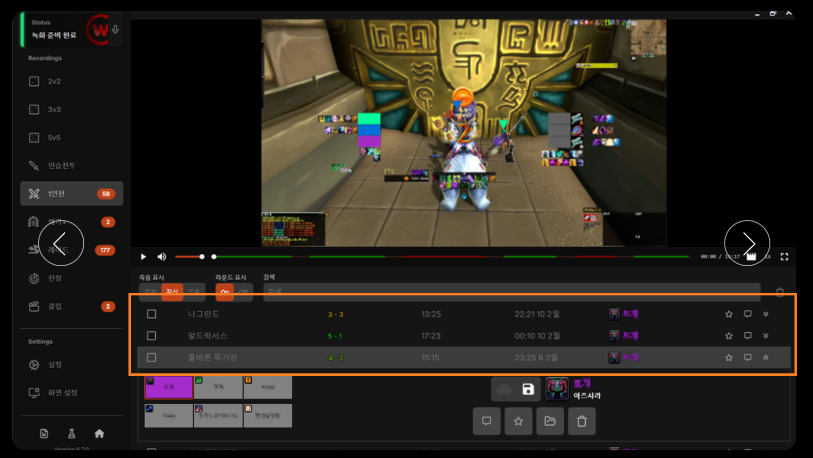
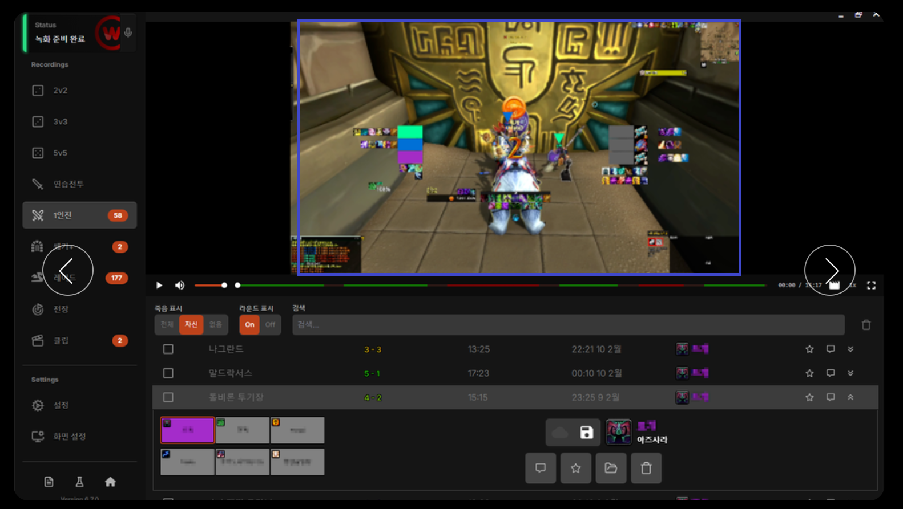

# FFXIV Auto Recorder 
# 1. Automatic detection
* AI vision model detects pull start(pullStartDetected() - leave unimplemented)- automatically starts recording
* AI vision model detects pull end(pullEndDetected() - leave unimplemented)- automatically ends recording
* Saves recording result in record list UI at the lower half of the screen so that it is easier to see

# 2. Embedded real-time video player
* Has an embedded video player that lets you see recorded pulls without the need to open the video in another video player.
* Can click on wanted segments using mouse, play and pause, has record screenshot button

## What it changes
To play replays in FFXIV, you had to 

* manually "turn on" replay on a replay took, which you sometimes forgot
* manually "turn on" video player to play the replay

With this tool we 1) auto record pulls so we only need to focus on playing the game 2) play the replay instantly without opening any media players.